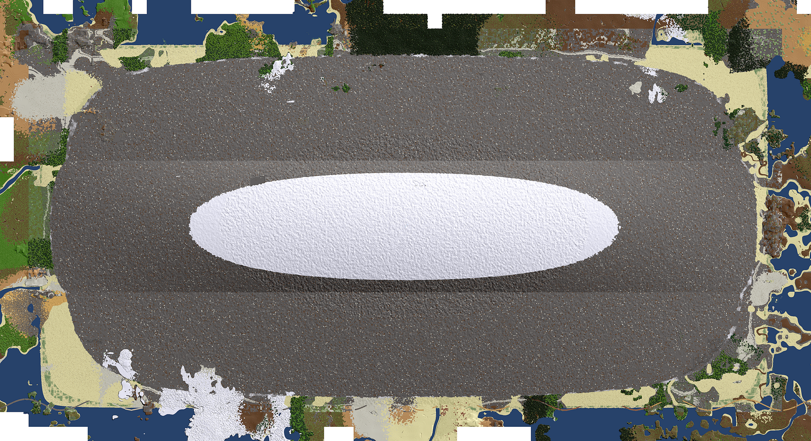
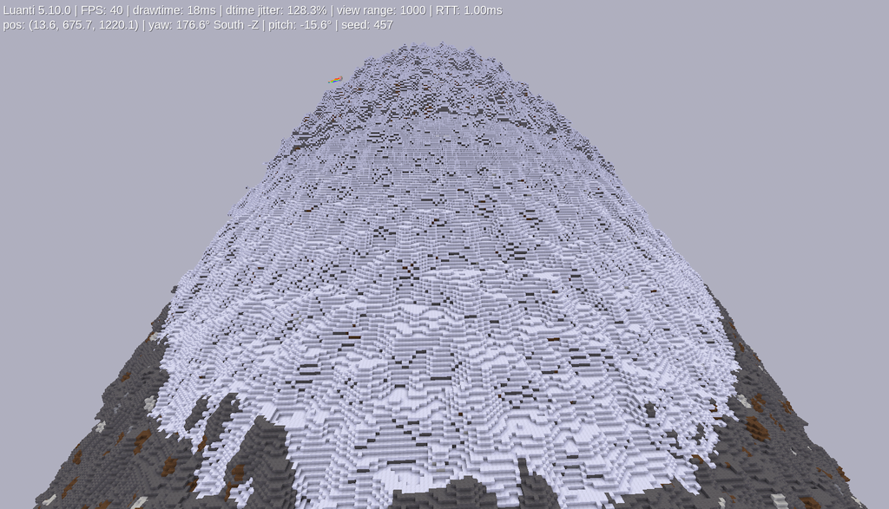
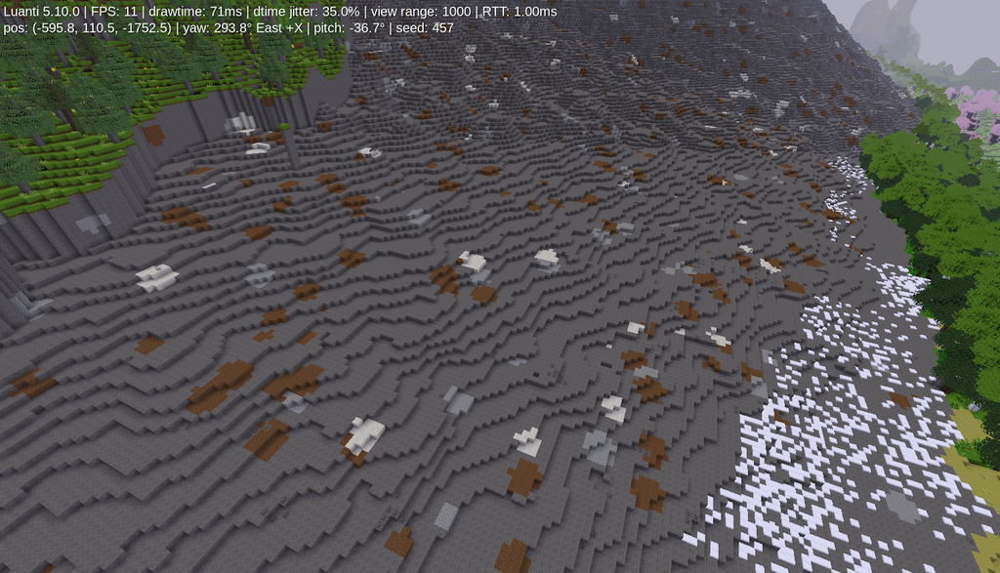

  Just a Mountain  :  01_a_mountain
-----

Adds a Mountain during worldgen.

The Mountain is about 1000 blocks high and has a base of a 2000x4000 blocks.

The Position of the mountain can be configured in the settings.

-----

-----

No new blocks/items or functions are added with this mod.

The mountains base materials are "mapgen_stone", "mapgen_water_source", "mapgen_snowblock" & "mapgen_ice".

Biome defined materials are used if available.

Once the mountain has been fully generated, the mod can be safely removed again.

-----

**License**: MIT

**Author**: DeadLock

**Thanks** NameNotQuality, Desour, Blockhead & sfan5	for Help, Ideas and Feedback on Ore-Generation 